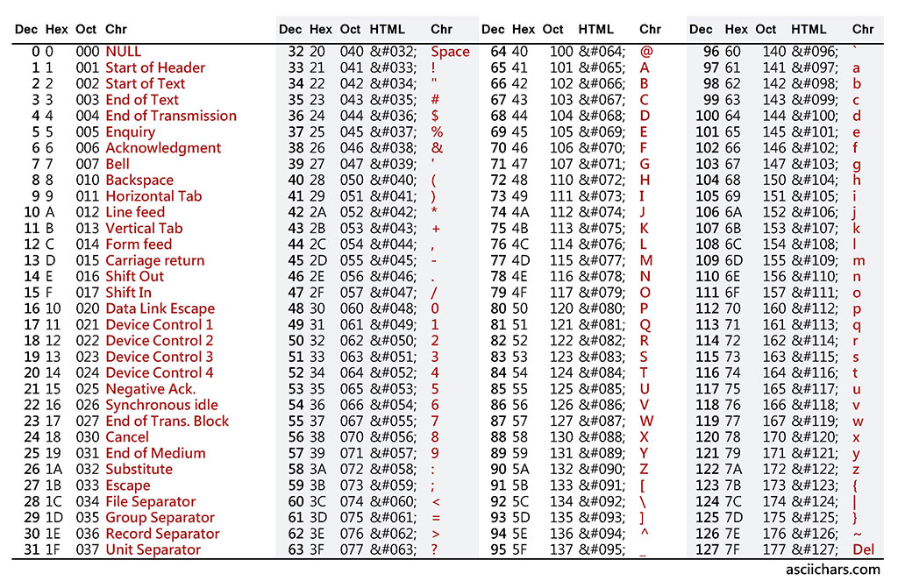

### Dynamic Array là gì
- Dynamic Array (mảng động) là cấu trúc dữ liệu dùng để lưu trữ các đối tượng có kích thước không xác định. Khác với mảng tĩnh, người dùng không cần phải khai báo trước số lượng phần tử khi sử dụng.
    + C++: vector
    + Java: ArrayList
    + Python: list
- String (chuỗi) là một kiểu dữ liệu gồm nhiều ký tự (character) liên tục nhau, các ký tự ở đây rất đa dạng có thể là chữ cái, số , dấu cách, hay các ký hiệu...
    + C++: string
    + Python: variable = ""
    + Java: String
- Bảng mã ASCII dùng để kiểm tra kí tự

    + Java
    <br/><b>isalpha/isLetter</b> : Kiểm tra ký tự có phải chữ cái hay không.
    <br/><b>isdigit/isDigit</b>: Kiểm tra ký tự thuộc dạng số hay không.
    <br/><b>islower/isLowerCase</b>: Kiểm tra ký tự viết thường hay không.
    <br/><b>isupper/isUpperCase</b>: Kiểm tra ký tự viết hoa hay không.
- Đọc từng từ và nguyên dòng
    </br><b>nothing is impossible</b>
    + C++: 
    ```
    String s0;
    cin >> s0;
    cout << s0;
    [nothing]
    ```
    ```
    string s1;
    getline(cin, s1);
    cout << s1;
    [nothing is impossible]
    ```
    + Python: Trong python chỉ đọc theo từng dòng nên không có sự phân biệt giữa đọc từng từ và đọc nguyên dòng. Để phân tách lấy ra từng từ thì ta có thể dùng hàm split sau khi đọc.
    ```
    line = input().split()
    s0 = line[0]
    print(s0)
    ```
    + Java
    ```
    Scanner sc = new Scanner(System.in);
    String s0 = sc.next();
    System.out.print(s0);
    [nothing]
    ```
    ```
    Scanner sc = new Scanner(System.in);
    String s1 = sc.nextLine();
    System.out.print(s1);
    ```

- Link referall
https://www.interviewcake.com/concept/java/dynamic-array?fbclid=IwAR0OAyg9EhIswHRscy3sch5sNpQj52Eso3C162ZegFerKNgww0CaxXLo_4A