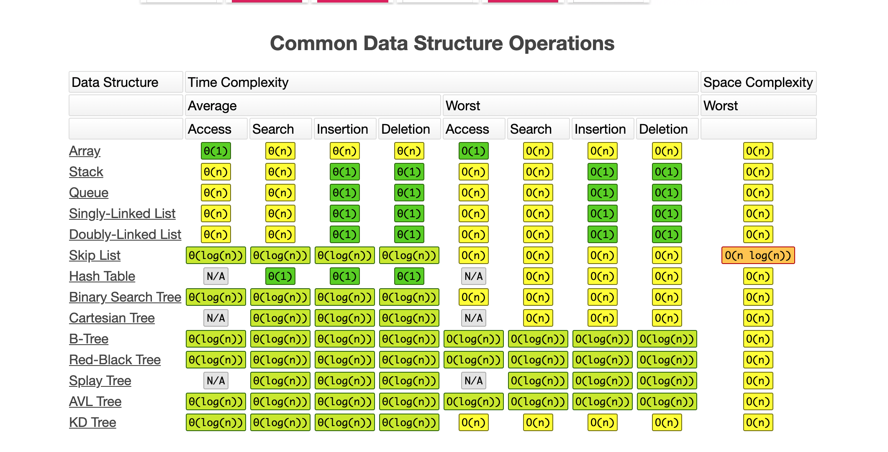
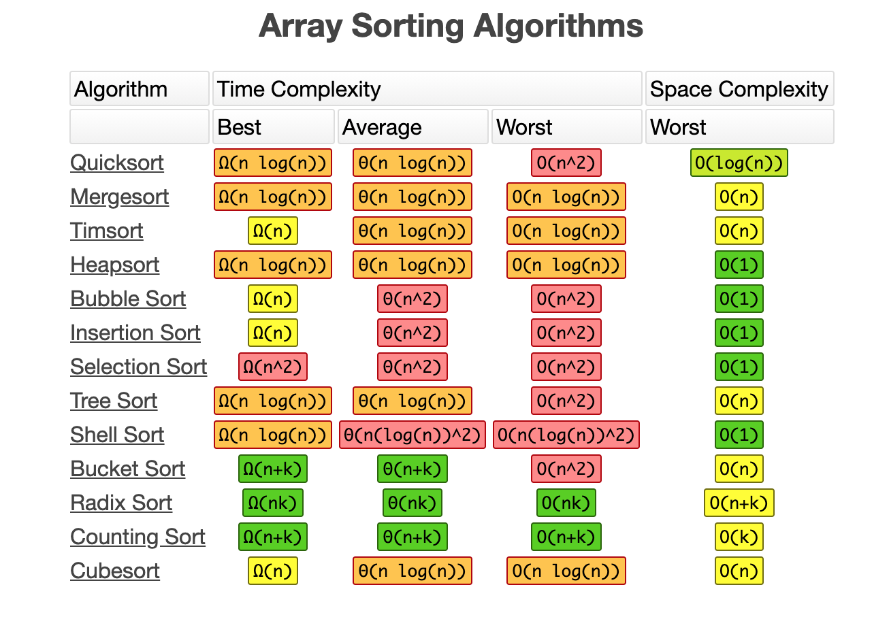

### Độ phức tạp thuật toán
Đối với <b>một thuật toán</b> có 2 độ phức tạp quan trọng cần chú ý:
- <b>Độ phức tạp về thời gian</b> (thời gian thuật toán chạy)
- <b>Độ phức tạp về không gian</b> (dung lượng bộ nhớ sử dụng)

----------------------
### Độ phức tạp thời gian
Độ phức tạp thời gian (time complexity): một khái niệm liên quan đến tốc độ thực thi của thuật toán. Các yếu tố liên quan bao gồm :
-   Kỹ năng lập trình
-   Chương trình dịch mã nguồn 
    ```
    Java = 3 x C++, Python = 5 x C++
    ```
-   Tốc độ xử lý của bộ vi dữ liệu
-   Bộ dữ liệu đầu vào

------------------------
### Khái niệm trong phân tích độ phức tạp
Người ta dùng một số khái niệm để ước lượng độ phức tạp thuật toán:
-   Cận trên (upper bound): [Big-O notation](https://en.wikipedia.org/wiki/Big_O_notation) có 3 trường hợp quan trọng cần xét:
    +   <b>Worst-case performance:</b> Trường hợp xấu nhất.
    +   Best-case performance: Trường hợp tốt nhất.
    +   Average performance: Trường hợp trung bình.
- Cận dưới (lower bound): [Big-Ω notation](https://en.wikipedia.org/wiki/Big_Omega_function)
- Cận chặt (tight bound): [Big-θ notation](https://www.educative.io/courses/visual-introduction-to-algorithms/jArRz)
- Độ phức tạp của một số cấu trúc data

- Độ phức tạp của một số thuật toán sắp xếp


Nguồn: https://www.bigocheatsheet.com/

### Một số dạng độ phức tạp thông dụng khi đánh giá độ phức tạp của thuật toán
-   Constant Time Complexity - O(1). Độ phức tạp hằng số là độ phức tạp mà số phép tính không phụ thuộc vào dữ liệu đầu vào. Thuật toán hữu hạn các thao tác thực hiện 1 lần hoặc vài lần.
```
Ví dụ: Tính tổng của x và y bằng C++

int x = 15 + (10 * 30);
int y = 59 - x;
count << x + y;
```

- Logarithmic Time Complexity - O(log(n)): Độ phức tạp logarit là độ phức tạp có thời gian thực hiện tăng theo kích thước dữ liệu đầu vào với tốc độ hàm logarit.
```
Ví dụ: Biến đếm count sẽ có giá trị bao nhiêu ?

int count = 0, c=2;
for (int i=1; i<n; i*=c) {
    count += 1;
}
```

- Line Time Complexity - O(n): Độ phức tạp tuyến tính là độ phức tạp số phép tính phụ thuộc vào dữ liệu đầu vào, với vòng lặp tăng/giảm một cách tuần tự.
```
Ví dụ: Tính tổng các phần tử của mảng a

int sumArray(int a[], int n){
    int sum = 0;
    for (int i=0; i<n; i++) {
        sum += a[i];
    }
    return sum;
}
```

- Log-Linear Time Complexity - O(nlog(n)): Độ phức tạp tuyến tính logaric là độ phức tạp thường hay xuất hiện trong các bài toán lớn được giải bằng cách kết hợp kết quả của nhiều bài toán nhỏ hơn được giải độc lập.
```
Ví dụ: Tính giá trị của biến count

int x = n;
int count = 0;
while (x>0) {
    int y =n;
    while (y>0) {
        y = y-1;
        count += 1;
    }
    x = x / 2;
}
```
- Polynomial Time Complexity - O(N^c): Độ phức tạp đa thức (với c là hằng số) là độ phức tạp với các thao tác được thực hiện trong các vòng lặp lồng nhau.
```
Ví dụ: Tính tổng các phần tử trong 2 mảng a và b.

int sum = 0;
for(int i=0; i<n; i++){
    for(int j=0; j<n; j++){
        sum += a[i] + b[i];
    }
}
```

- Exponential Time Complexity - O(C^n): Độ phức tạp hàm mũ là độ phức tạp số phép tính phụ thuộc vào hàm mũ n của dữ liệu đầu vào, đây là độ phức tạp rất lớn. Khi n đủ lớn, có thể xem bài toán không giải được theo nghĩa là không nhận được lời giải trong một thời gian hữu hạn.
```
Ví dụ: Tìm số Fibonacci thứ n.

int F(int n) {
    if (n=0) {
        return 0;
    } else if (n == 1) {
        return 1;
    } else {
        return F(n-1) + F(n - 2);
    }
}
```

- Factorial Time Complexity - O(n!): Độ phức tạp giai thừa cũng tương tự như độ phức tạp hàm mũ, đây là lớp thuật toán có độ phức tạp lớn, thường gặp trong các bài toán quay lui, quét cạn.

```
Ví dụ: Bài toán Traveling salesman problem.

Giả sử chúng ta có 3 thành phố người này cần đi qua. Vậy tổng cộng sẽ có 3! trường hợp có thể sảy ra:
1->2->3
1->3->2
2->1->3
2->3->1
3->1->2
3->2->1

- N ngôi nhà -> khoảng N! hành trình khác nhau.
- 100 ngôi nhà, kiểm tra 1 hành trình/giây -> 100! hành trình = 2.96 x 10^148 thế kỷ.
```
- Các thuật toán Metaheuristic tham khảo: Simulated annealing, Tabu search, Ant colony, Genetic algorithm, Harmony search.
--------
### Quy tắc đánh giá độ phức tạp thuật toán
- Quy tắc hằng (Multiplicative Constants):
    +   O(k*f(n)) = O(f(n))
    +   Ví dụ: O(1000n) = O(n)
- Quy tắc cộng (Addition Rule):
    +   O(f(n) + g(n)) = O(max(f(n), g(n)))
    +   Ví dụ: O(n^2 + 3n + 2) = O(n^2)
- Quy tắc nhân (Multiplication Rule):
    +   O(f(n) * g(n)) = O(f(n)) * O(g(n))
    + Ví dụ: O(n^2) * O(log n) = O(n^2log(n))
----------

### Độ phức tạp không gian
Độ phức tạp không gian (Space complexity): là dung lượng bộ nhớ ước tính phát sinh khi thực thi tuật toán.
-    Kỹ năng lập trình.
-   Các biến cần lưu thực hiện chương trình.
-   Các cấu trúc dữ liệu cần lưu khi thực hiện chương trình.
- Thuật toán
-   ** Ngày nay độ phức tạp không gian ít được chú ý do sự phát triển về công nghệ lưu trữ và truy xuất dữ liệu.

### Hàm đánh giá độ phức tạp không gian
-   Constant Space Complexity - O(1): Độ phức tạp hằng số là độ phức tạp số phép tính không phụ thuộc vào dữ liệu đầu vào. Chỉ thao tác trên 1 biến hoặc một vài biến
```
Ví dụ: tính tổng từ 1 đến n

int s = 0;
for (int i =0; i<=n; i++) {
    s += i;
}
```
-  Linear Space Complexity - O(n): Độ phức tạp không gian tuyến tính là độ phức tạp thao tác trên biến của mảng có n phần tử.
```
Ví dụ: Tính tổng giá trị phần tử của mảng theo công thức cho trước

int sum = 0;
vector<int> a; a[0] = 1;
for (int i=0; i<=n; i++) {
    a[i] = a[i-1] * 2;
    sum += a[i];
}
```
-------------
### Link referrall

-   https://www.cs.cmu.edu/~adamchik/15-121/lectures/Algorithmic%20Complexity/complexity.html?fbclid=IwAR0ct8v4JkGyOgBnbZDLAv-rFkEdIBYyQWHjxy2SbyyDobAXoazipHTCpcA

- https://www.khanacademy.org/computing/computer-science/algorithms/asymptotic-notation/a/functions-in-asymptotic-notation