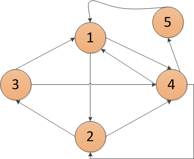

### Giới thiệu sơ nét về đồ thị
Đồ thị là các đối tượng bao gồm các đỉnh (vertices) được nối với nhau bởi các cạnh (edges). Đồ thị có 2 dạng cơ bản thường gặp:
-   Đồ thị có hướng (Directed graph)

-   Đồ thị vô hướng (Undirected graph)

- Đồ thị có trọng số (weighted graph): là đồ thị mà mỗi cạnh có gắn một giá trị nào đó gọi là đồ thị có trong số. Đồ thị có trọng số bao gồm vô hướng và có hướng.


--------
### Thuật toán BFS
<b>Breadth-first Search</b> (Thuật toán tìm kiếm theo chiều rộng): là thuật toán tìm kiếm trên đồ thị <b>vô hướng</b> hoặc <b>có hướng</b>, <b>không trọng số</b> nếu có trọng số thì trọng số các đường đi đều giống nhau, BFS giải quyết bài toán:
-   Tìm kiếm đường đi từ một đỉnh bất kỳ tới tất cả các đỉnh khác trong đồ thị (nếu 2 đỉnh thuộc cùng thành phần liên thông với nhau).
- <b>Luôn tìm được đường đi ngắn nhất (nếu tồn tại đường đi)</b>.

<b>Độ phức tạp: O(V + E)</b>
-   V (Vertices): số lượng đỉnh của đồ thị.
-   E (Edges): số lượng cạnh của đồ thị.

<b>Ý tưởng thuật toán:</b>
Xuất phát từ 1 đỉnh bất kỳ, đi tới tất cả các đỉnh kề của đỉnh này và lưu các đỉnh kề này lại.
[Wiki BFS](https://vi.wikipedia.org/wiki/T%C3%ACm_ki%E1%BA%BFm_theo_chi%E1%BB%81u_r%E1%BB%99ng)

### Example

<b>Breadth First Search: Shortest Reach</b></br>
Consider an undirected graph consisting of N nodes where each node is labeled from 1 to N and the edge between any two nodes is always of length 6. We define node S to be the starting position for a BFS.

Given Q queries in the form of a graph and some starting node, S, perform each query by calculating the shortest distance from starting node S to all the other nodes in the graph. Then print a single line of N - 1 space-separated integers listing node S is shortest distance to each of the N - 1 other nodes (ordered sequentially by node number); if S is disconnected from a node, print -1 as the distance to that node.
<br/>
<br/>
<b>Dữ liệu nhập</b><br/>
The first line contains an integer, Q denoting the number of queries. The subsequent lines describe each query in the following format:

The first line contains two space-separated integers describing the respective values of N (the number of nodes) and M (the number of edges) in the graph.
Each line i of the M subsequent lines contains two space-separated integers, u and v describing an edge connecting node u to node v.<br/>
The last line contains a single integer, SS, denoting the index of the starting node.<br/>
Constraints<br/>
1 ≤ Q ≤ 10 <br/>
2 ≤ N ≤ 1000 <br/>
1 ≤ M ≤ n*(n-1)/2 <br/>
1 ≤ u,v,S ≤ N

<b>Dữ liệu xuất</b> <br/>
For each of the Q queries, print a single line of N−1 space-separated integers denoting the shortest distances to each of the N−1 other nodes from starting position S. These distances should be listed sequentially by node number (i.e., 1, 2, ...,N), but should not include node S. If some node is unreachable from S, print −1 as the distance to that node.

<b>Ví dụ</b></br>
Input
```
2
4 2
1 2
1 3
1
3 1
2 3
2
```
out put
```
6 6 -1
-1 6
```

### Sử dụng BFS
<b>Tutorial</b><br/>
Bài này áp dụng BFS cơ bản, đọc vào số lượng đỉnh của đồ thị và danh sách cạnh. Sau đó chạy BFS bắt đầu từ điểm SS. Viết một hàm đếm các cạnh đi qua từ S đến các đỉnh khác. Lấy kết quả đếm nhân 6 để ra kết quả cần tìm.

Tuy nhiên ta có thể biến tấu thuật toán BFS đôi chút để có được kết quả ngay lúc duyệt đồ thị.

Gọi dist[v] lưu khoảng cách ngắn nhất từ đỉnh S đến đỉnh v. Với đỉnh v có được thông qua duyệt các đỉnh kề của đỉnh u. Như vậy dễ dàng nhận thấy dist[v]=dist[u]+1, nghĩa là từ S đến v ta mất một quãng đường bằng khoảng cách từ S đến u và từ u đến v (chưa tính trọng số 6 của mỗi cạnh).

Cuối cùng cho vòng lặp i duyệt lại toàn bộ các đỉnh trong đồ thị. Nếu đỉnh đó chưa được viếng thăm thì in -1, ngược lại in dist[i] * 6 với trọng số của mỗi cạnh là 6.

<b>Độ phức tạp: </b> 
O(T∗(V+E)) với T là số lượng test, V là số lượng đỉnh trong đồ thị và E là số lượng cạnh trong đồ thị.
```
import java.util.*;
 
public class Main {
    static final int MAX = 1000 + 5;
    static int V, E;
    static boolean[] visited = new boolean[MAX];
    static int[] dist = new int[MAX];
    static ArrayList<Integer> graph[] = new ArrayList[MAX];
 
    public static void BFS(int s) {
        Queue<Integer> q = new LinkedList<>();
        visited[s] = true;
        q.add(s);
 
        while (!q.isEmpty()) {
            int u = q.poll();
 
            for (int v : graph[u]) {
                if (!visited[v]) {
                    visited[v] = true;
                    dist[v] = dist[u] + 1;
                    q.add(v);
                }
            }
        }
    }
 
    public static void main(String[] agrs) {
        Scanner sc = new Scanner(System.in);
        int Q = sc.nextInt();
         
        for (int i = 0; i < MAX; i++) {
            graph[i] = new ArrayList<>();
        }
 
        while (Q-- > 0) {
            V = sc.nextInt();
            E = sc.nextInt();
 
            for (int i = 0; i < MAX; i++) {
                graph[i].clear();
                visited[i] = false;
                dist[i] = 0;
            }
 
            for (int i = 0; i < E; i++) {
                int u = sc.nextInt();
                int v = sc.nextInt();
                graph[u].add(v);
                graph[v].add(u);
            }
 
            int s = sc.nextInt();
            BFS(s);
 
            for (int i = 1; i <= V; i++) {
                if (i == s) {
                    continue;
                }
 
                System.out.print((visited[i] ? dist[i] * 6 : -1) + " ");
            }
 
            System.out.println();
        }
    }
}
```