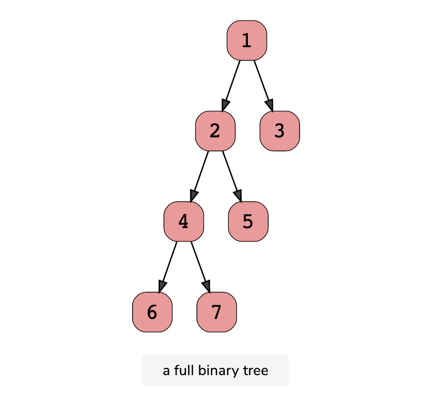
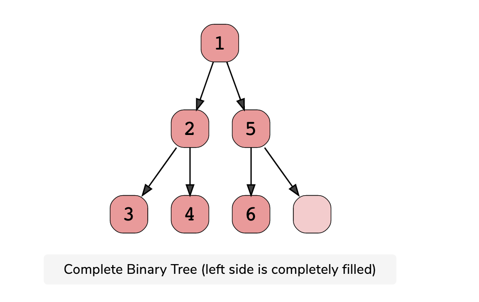
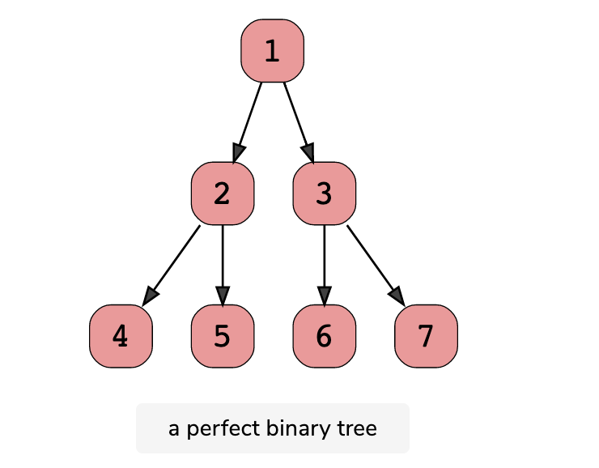

### HEAP
<b>Heap (Đống)</b> là cấu trúc cây nhị phân hoàn chỉnh (complete binary tree). Có 2 loại Heap:
-   Min-heap: Mỗi node cha đều có giá trị nhỏ hơn hoặc bằng node con của nó.
-   Max-heap: Mỗi node cha đều có giá trị lớn hơn hoặc bằng node con của nó.

### Các loại cây nhị phân
- Full Binary Tree: A full binary tree (sometimes called proper binary tree) exits when every node, excluding the leaves, has two children. Every level must be filled, and the nodes are as far left as possible. Look at this diagram to understand how a full binary tree looks.



-   Complete binary Tree: A complete binary tree exists when every level, excluding the last, is filled and all nodes at the last level are as far left as they can be. Here is a visual representation of a complete binary tree.



-   Perfect binary Tree: A perfect binary tree should be both full and complete. All interior nodes should have two children, and all leaves must have the same depth. Look at this diagram to understand how a perfect binary tree looks.



### Ứng dụng và độ phức tạp của Heap
<b>Ứng dụng</b>
1.  Heap dùng để cài đặt và giải quyết bài toán liên quan đến hàng đợi ưu tiên "priority queue".
2. Dùng để tối ưu hoá các thuật toán Dijkstra, Prim ...
3. Thuật toán sắp xếp Heapsort.

<b>Độ phức tạp của các thao tác trên Heap:</b>
1.  Xây dựng cây Heap từ mảng : O(n).
2. Tìm phần tử lớn nhất / nhỏ nhất trên Heap: O(1).
3. Thêm một phần tử vào Heap: O(log(n))
4. Xoá một phần tử trong Heap: O(log(n))

### Sử dụng Heap bằng thư viện STL trong C++
priority_queue (hàng đợi ưu tiên) trong C++ là một cấu trúc dữ liệu dùng để lưu trữ sao cho phần tử ở đỉnh luôn luôn là phần tử có độ lưu tiên lớn nhất so với các phần tử khác.
```
#include <queue>
using namespace std;

// khai báo max heap
priority_queue<data_type> variable;

// khai báo min heap
priority_queue<int, vector<int>, greater<int>> pq;

// Add phần tử vào priority queue
pq.push(data)

// Trả về giá trị node gốc của hàng đợi ưu tiên chứa giá trị nhỏ nhất đối với min heap hoặc lớn nhất đối với mã heap
pq.top()

// Xoá phần tử đầu trong hàng đợi ưu tiên
pq.pop()

// Hoán đổi 2 hàng đợi ưu tiên với nhau
pq1.swap(pq2)

// clear: dùng phương pháp gán cho một hàng đợi ưu tiên mới
pq = priority_queue<int>();
```

### Sử dụng heap bằng thư viện QUEUE trong python
PriorityQueue (hàng đợi ưu tiên) trong python là một cấu trúc dữ liệu dùng để lưu trữ sao cho phần tử ở đỉnh luôn luôn là phần tử có độ ưu tiên lớn nhất so với các phần tử khác. Trong python có 2 cách sử dụng khác nhau: sử dụng priorityQueue và sử dụng heapq.

```
// Python2.x
import Queue
// Python 3.x
import queue

// khai báo
variable = queue.PriorityQueue();

// sử dụng như max heap bằng cách tạo một class mới và define operator __lt__ cho object đó.

class PQEntry:
    def __int__(self, value):
        self.value = value
    def __lt__(self, other):
        return self.value > other.value
a = [7, 12, 3, 4]
pq = queue.PriorityQueue()
for x in a:
    pq.put(PQEntry(x))

// sử dụng như min heap
pq = queue.PriorityQueue()

// trả về giá trị node gốc của hàng đợi ưu tiên
pq.queue[0]

// thêm một phần tử vào PriorityQueue
pq.put(obj)

// xoá phần tử đầu trong PriorityQueue và trả về giá trị của phần tử đó
value = pq.get()

// xoá toàn bộ phần tử trong PriorityQueue. Dùng phương pháp gán cho một priority queue mới
pq = queue.PriorityQueue()

// lấy kích thước của priority queue
len(pq.queue)
```
Trong Python, ngoài PriorityQueue ra còn có một thư viện khác hỗ trợ xây dựng một cây binary heap là heapq. Heapq là thư viện chứa các hàm hỗ trợ các thao tác cơ bản trong heap.
-   Ưu điểm: tốc độ nhanh hơn PriorityQueue và dễ sử dụng hơn PriorityQueue cũng như Heap tự cài đặt
-   Nhược điểm: heapq không tự lưu lại cấu trúc heap mà chỉ sử dụng 1 mảng (list) trong tham số đầu vào để xử lý nên cần quản lý chặt vùng nhớ. Cần khai báo đầy đủ các toán tử so sánh cần thiết trong trường hợp sử dụng cấu trúc heap với cấu trúc dữ liệu tự định nghĩa.

```
import heapq

// heapq chỉ là tập hợp các hàm sử lý trong heap, nên để sử dụng được ta cần có một list sẵn để chứa heap.

variable = []

// sử dụng như max-heap, có thể đảo dấu giá trị hoặc tạo một clas mới và define operator __lt__ cho object như PriorityQueue:

class PQEntry:
    def __int__(self, value):
        self.value = value
    def __lt__(self, other):
        return self.value > other.value

a = [7, 12, 6, 10]
h = []
for x in a:
    heapq.heappush(h, PQEntry(x))

// Dùng heapq.heapify(list) để chuẩn hoá một list thành heap. Độ phức tạp O(n), mặc định là min-heap

h = [7, 12, 6, 10, 17, 15]
heapq.heapity(h)

// Thêm một phần tử vào heap
heapq.heappush(h, 3)

// Lấy giá trị và xoá phần tử đầu trong heap

heapq.heappop(h)

// clear: Vì heapq chỉ là thư viện chứa hàm, nên để xoá toàn bộ phần tử của heap ta chỉ việc clear dữ liệu trong list chứa các phần tử của heap là được

h.clear
```